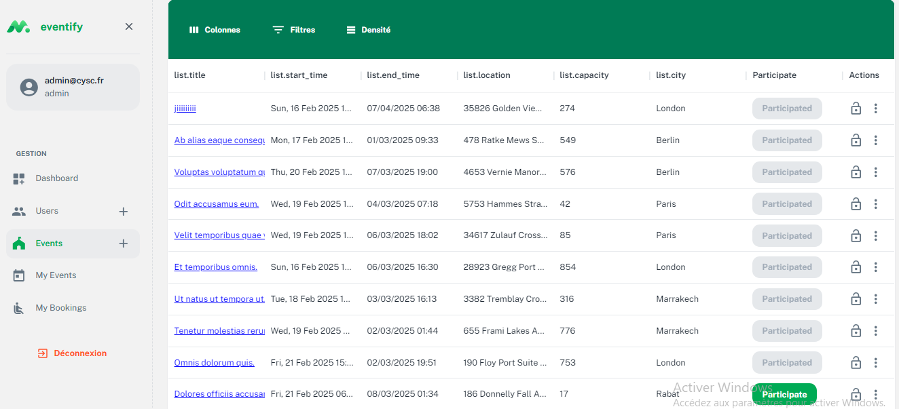

# Eventify (Frontend) 🎉

**Eventify** is the frontend of an event management platform built with Next.js and React. Users can browse events, join with one click, and view real-time updates. *(Backend integration pending.)*

 

---

## ✨ Frontend Features

- **User Authentication UI**  
  Clean login/registration interface (custom auth flow).

- **Event PArticipation**  
  - Join events instantly via a **"Participate"** button.  

- **Real-Time Notifications UI**  
  Visual alerts when event details change (e.g., Event Updated).  

- **Event Creation Form**  
  Intuitive form for organizers to create new events.  

- **Light Design**  
 Navigate smoothly.  

---

## 🛠 Tech Stack

- **Framework**: Next.js (React)  
- **State Management**: Context API and React Hooks  
- **Routing**: Next.js Dynamic Routing  
 

---

## 🚀 Installation

1. **Clone the Frontend Repository**  
   ```bash
   git clone [https://github.com/CyberScale-test/eventify-front-end.git]
   cd eventify
   npm install
   npm run dev
   cp .env.example .env 
   npm instal Dayjs
   npm install pusher-js
   npm install react-toastify
   
